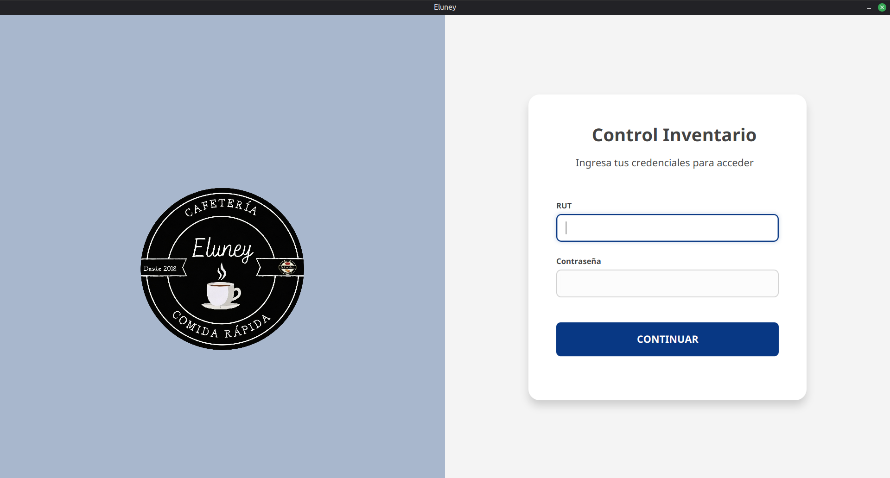
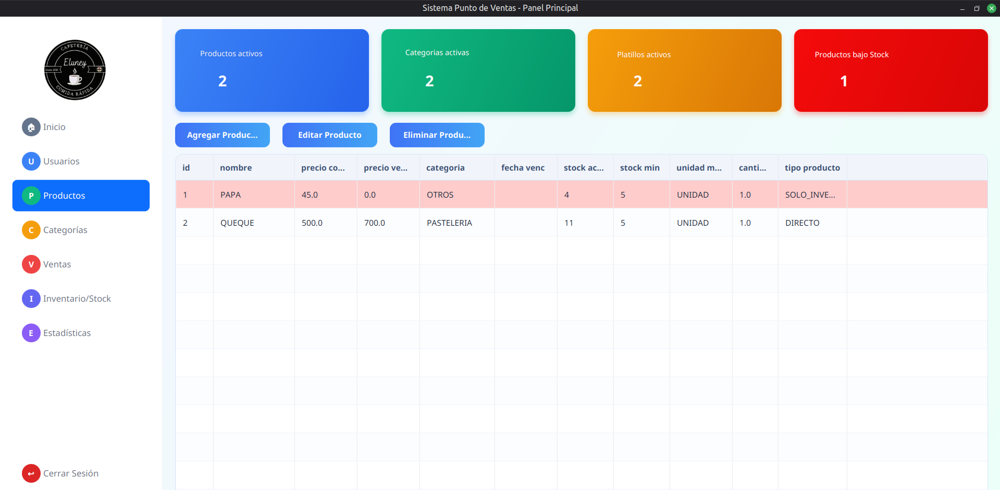

<div align="center">
  
   # App Sistema Punto de Ventas e Inventario
   Aplicacion de escritorio para gestion de ventas, control de inventario y prediccion de demanda con IA.
   
  
  
  

 
</div>


## Funcionalidades

- **Registro de Ventas** — Transacciones en tiempo real con detalle por producto/platillo
- **Control de Inventario** — Gestion de stock, entradas/salidas, alertas de stock minimo
- **Modulo de Productos y Platillos** — CRUD completo con categorias y recetas
- **Prediccion de Demanda** — IA (Prophet) que proyecta agotamiento de stock y sugiere reabastecimiento
- **Multiples Roles** — Admin y Vendedor con permisos diferenciados
- **Sesion Persistente** — Inicio automatico sin re-login
- **Dashboard y Estadisticas** — Metricas visuales, ranking de productos, balance financiero
- **Auditoria** — Trazabilidad de eventos en el sistema

## Stack Tecnologico

| Capa          | Tecnologia                          |
|---------------|-------------------------------------|
| UI            | JavaFX 17 + FXML + CSS              |
| Lenguaje      | Java 17                             |
| Base de Datos | SQLite (JDBC)                       |
| Build         | Maven                               |
| IA Predictiva | Python 3.8+ / Prophet               |
| Testing       | JUnit 5 + Mockito                   |

## Requisitos

- JDK 17 o superior
- Maven 3.6+
- Python 3.8+ con `pip install prophet pandas`
- (Opcional) SQLite CLI para depuracion

## Testing

```bash
mvn test
```

## Modulo de IA (Prediccion de Stock)

```bash
mvn exec:java -Dexec.mainClass="com.sistema.puntoventas.pruebas.PruebaPrediccionStock"
```

> Requiere librerias Python: `prophet` y `pandas`

## Estructura del Proyecto

```
src/
├── main/
│   ├── java/com/sistema/puntoventas/
│   │   ├── controller/       # Controladores JavaFX
│   │   ├── service/          # Logica de negocio
│   │   ├── repository/       # Acceso a datos
│   │   ├── modelo/           # Entidades/DTOs
│   │   ├── conexion/         # DbManager
│   │   └── pruebas/          # Tests manuales
│   ├── resources/
│   │   ├── com/sistema/puntoventas/  # FXML + CSS
│   │   └── Img/                      # Imagenes
```
